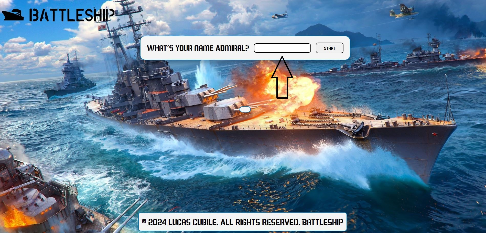
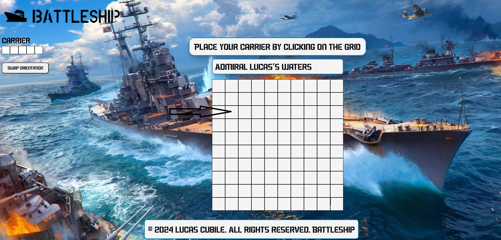
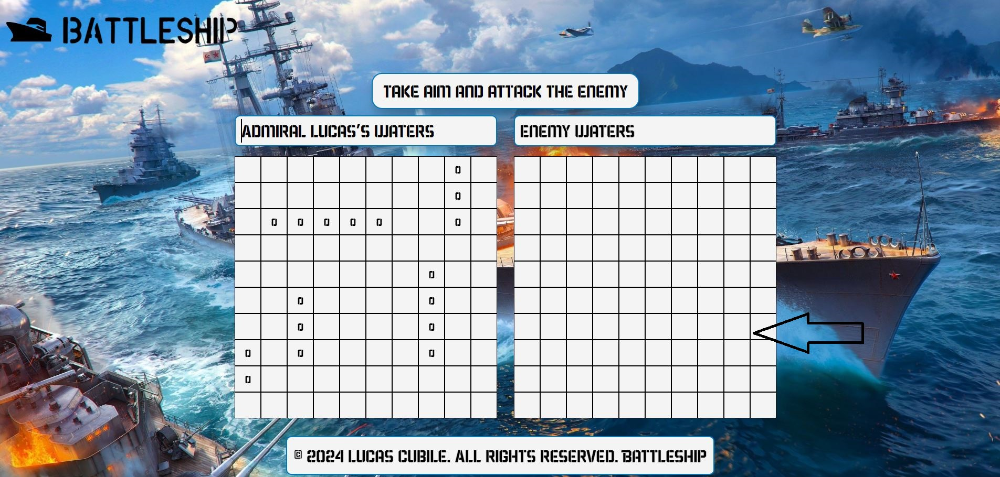
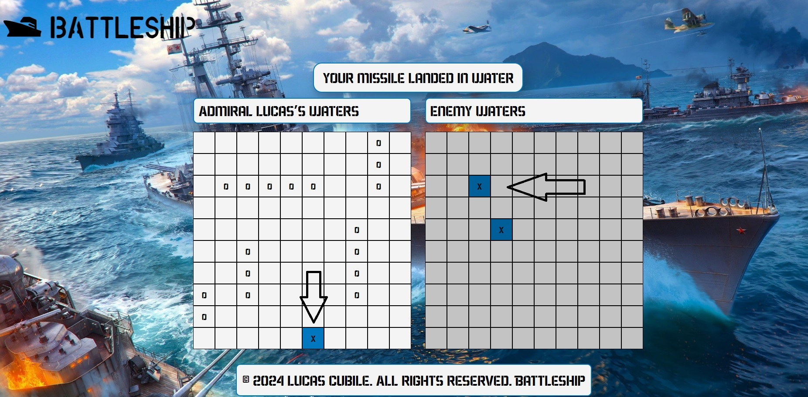
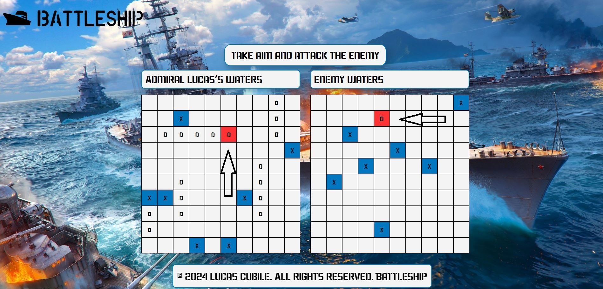
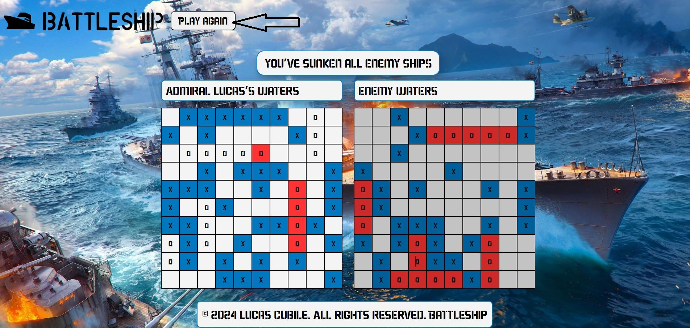

# Battleship

A battleship game to finalize the vanilla javascript section.

# What the project is about

The project is a battleship game played agains a compute AI.

# What have I learned so far?

<ul>
  <li>Generation of random values.</li>
  <li>Combination of Object oriented programming and functional programming in one project.</li>
</ul>

# Want to see it in action?

<a href="https://hroglardev.github.io/Battleship/" target="_blank">Click here</a>

# How to use the app.

The app starts by asking the user his/her name.

After doing so, the user will be asked to place the ships on the grid by clicking the starting point of the ship (by default, the orientation is horizontal).

If the user wishes to swap the orientation of the ship, the button on the screen's side can be used.

After all ships have been placed, start attacking the enemy by clicking any cell on the enemy grid.

If the user misses, the cell will display an "x" and the blue color representing water. After each attack, the computer will target the user's grid and attempt to hit the user.

Successful hits are represented by a red cell along with "o" reprenseting a ship cell.

When either the player or the pc wins, the grid becomes inactive and a button at the header is displayed to trigger a replacement of ships for the player.

# Want to track my progress?

Checkout my other projects in order to see my evolution:

<ol>
  <li><a href="https://github.com/hroglardev/odin-recipes" target="_blank">Recipes</a></li>
  <li><a href="https://github.com/hroglardev/Odin-landing-page" target="_blank">Landing Page</a></li>
  <li><a href="https://github.com/hroglardev/Rock-Paper-Scissors-TOP-Console" target="_blank">Console Rock, Paper, Scissors</a></li>
  <li><a href="https://github.com/hroglardev/Rock-Paper-Scissors-TOP" target="_blank">Rock, Paper, Scissors</a></li>
  <li><a href="https://github.com/hroglardev/Etch-a-Sketch" target="_blank">Etch a Sketch</a></li>
  <li><a href="https://github.com/hroglardev/Calculator" target="_blank">Calculator</a></li>
  <li><a href="https://github.com/hroglardev/Sign-up-form-TOP" target="_blank">Sign up form</a></li>
  <li><a href="https://github.com/hroglardev/Dashboard" target="_blank">Dashboard</a></li>
  <li><a href="https://github.com/hroglardev/Library" target="_blank">Library</a></li>
  <li><a href="https://github.com/hroglardev/Tic-tac-toe" target="_blank">Tic-tac-toe</a></li>
  <li><a href="https://github.com/hroglardev/Restaurant-page" target="_blank">Restaurant page</a></li>
  <li><a href="https://github.com/hroglardev/To-do-list-js" target="_blank">To-do-list</a></li>
  <li><a href="https://github.com/hroglardev/Weather-app" target="_blank">Weather app</a></li>
  <li><a href="https://github.com/hroglardev/Battleship" target="_blank">You are here</a></li>
  <li><a href="https://github.com/hroglardev/Lucas-Cubile" target="_blank">Portfolio</a></li>
</ol>

These are all my projects in my basic section of my coding journey. I will continue with it in the React section along with back-end programming.

If you'd like to skip my basic projects and jump straight to the next section, you can jump to it in the following link.

<a href="https://github.com/hroglardev/CV-creator" target="_blank">React - Backend</a>
